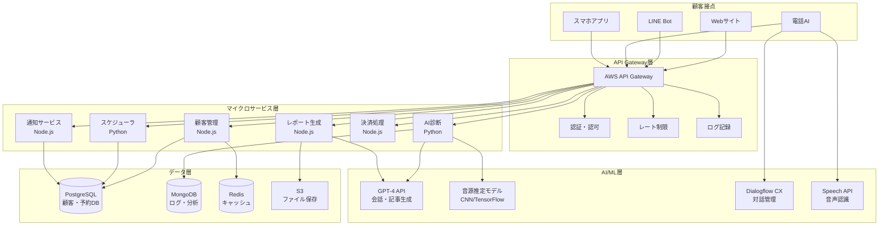
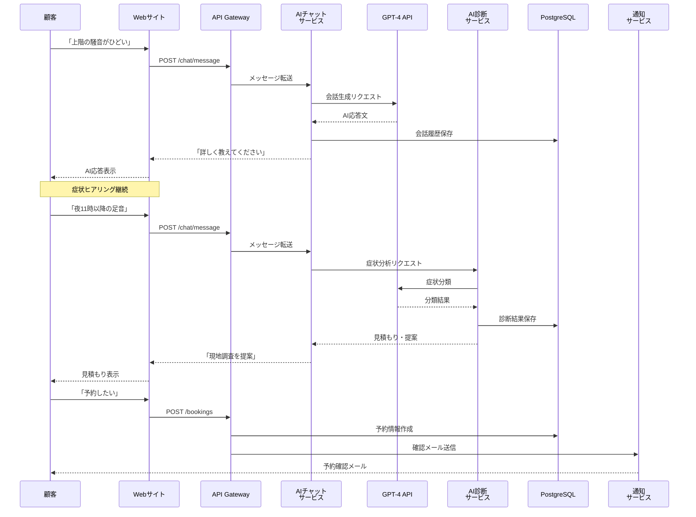
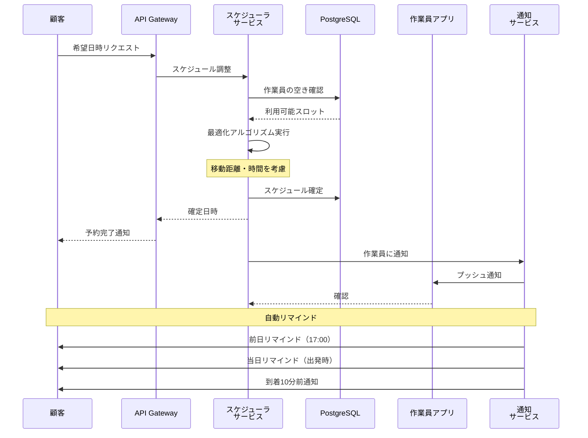
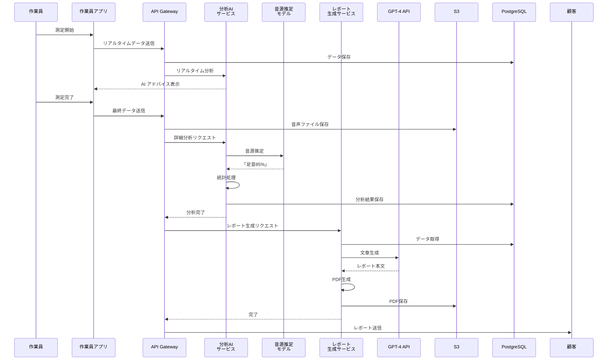

# ZENBU AI自動化システム - アーキテクチャ詳細設計

## システム全体フロー



## データフロー詳細

### 1. 初回問い合わせフロー



### 2. スケジューリングフロー



### 3. 測定〜レポート生成フロー



## データベース設計

### PostgreSQL スキーマ

```sql
-- 顧客テーブル
CREATE TABLE customers (
    id UUID PRIMARY KEY DEFAULT gen_random_uuid(),
    name VARCHAR(100) NOT NULL,
    email VARCHAR(255) UNIQUE NOT NULL,
    phone VARCHAR(20),
    line_user_id VARCHAR(100) UNIQUE,
    created_at TIMESTAMP DEFAULT CURRENT_TIMESTAMP,
    updated_at TIMESTAMP DEFAULT CURRENT_TIMESTAMP,
    customer_type VARCHAR(20) DEFAULT 'individual', -- individual, corporate
    first_visit_date DATE,
    total_visits INTEGER DEFAULT 0,
    lifetime_value DECIMAL(10,2) DEFAULT 0
);

-- 物件テーブル
CREATE TABLE properties (
    id UUID PRIMARY KEY DEFAULT gen_random_uuid(),
    customer_id UUID REFERENCES customers(id),
    address TEXT NOT NULL,
    building_name VARCHAR(200),
    room_number VARCHAR(20),
    area_type VARCHAR(50), -- residential, commercial
    building_type VARCHAR(50), -- mansion, apartment, house
    latitude DECIMAL(10,8),
    longitude DECIMAL(11,8),
    created_at TIMESTAMP DEFAULT CURRENT_TIMESTAMP
);

-- 予約テーブル
CREATE TABLE bookings (
    id UUID PRIMARY KEY DEFAULT gen_random_uuid(),
    customer_id UUID REFERENCES customers(id),
    property_id UUID REFERENCES properties(id),
    worker_id UUID REFERENCES workers(id),
    scheduled_date DATE NOT NULL,
    scheduled_time_start TIME NOT NULL,
    scheduled_time_end TIME NOT NULL,
    status VARCHAR(20) DEFAULT 'pending', -- pending, confirmed, in_progress, completed, cancelled
    created_at TIMESTAMP DEFAULT CURRENT_TIMESTAMP,
    updated_at TIMESTAMP DEFAULT CURRENT_TIMESTAMP,
    urgency_level VARCHAR(20), -- low, medium, high
    estimated_price DECIMAL(10,2),
    actual_price DECIMAL(10,2),
    CONSTRAINT valid_time_range CHECK (scheduled_time_end > scheduled_time_start)
);

-- 作業員テーブル
CREATE TABLE workers (
    id UUID PRIMARY KEY DEFAULT gen_random_uuid(),
    name VARCHAR(100) NOT NULL,
    email VARCHAR(255) UNIQUE NOT NULL,
    phone VARCHAR(20),
    certification_number VARCHAR(50),
    status VARCHAR(20) DEFAULT 'active', -- active, inactive, on_leave
    current_latitude DECIMAL(10,8),
    current_longitude DECIMAL(11,8),
    last_location_update TIMESTAMP,
    created_at TIMESTAMP DEFAULT CURRENT_TIMESTAMP
);

-- 測定結果テーブル
CREATE TABLE measurements (
    id UUID PRIMARY KEY DEFAULT gen_random_uuid(),
    booking_id UUID REFERENCES bookings(id),
    measured_at TIMESTAMP NOT NULL,
    duration_minutes INTEGER,
    average_db DECIMAL(5,2),
    max_db DECIMAL(5,2),
    min_db DECIMAL(5,2),
    std_dev DECIMAL(5,2),
    audio_file_url TEXT,
    raw_data_url TEXT,
    environmental_standard DECIMAL(5,2),
    exceeds_standard BOOLEAN,
    created_at TIMESTAMP DEFAULT CURRENT_TIMESTAMP
);

-- 音源推定結果テーブル
CREATE TABLE sound_source_estimates (
    id UUID PRIMARY KEY DEFAULT gen_random_uuid(),
    measurement_id UUID REFERENCES measurements(id),
    source_type VARCHAR(50), -- footsteps, voice, music, appliance, etc.
    confidence DECIMAL(5,4), -- 0.0000 to 1.0000
    frequency_range VARCHAR(50),
    created_at TIMESTAMP DEFAULT CURRENT_TIMESTAMP
);

-- レポートテーブル
CREATE TABLE reports (
    id UUID PRIMARY KEY DEFAULT gen_random_uuid(),
    measurement_id UUID REFERENCES measurements(id),
    report_type VARCHAR(50), -- customer, property_manager, lawyer, court
    pdf_url TEXT,
    generated_at TIMESTAMP DEFAULT CURRENT_TIMESTAMP,
    ai_generated BOOLEAN DEFAULT TRUE,
    reviewed_by UUID REFERENCES workers(id),
    review_status VARCHAR(20) DEFAULT 'pending' -- pending, approved, rejected
);

-- 支払いテーブル
CREATE TABLE payments (
    id UUID PRIMARY KEY DEFAULT gen_random_uuid(),
    booking_id UUID REFERENCES bookings(id),
    amount DECIMAL(10,2) NOT NULL,
    payment_method VARCHAR(50), -- credit_card, bank_transfer, qr_code, cash
    payment_status VARCHAR(20) DEFAULT 'pending', -- pending, completed, failed, refunded
    stripe_payment_intent_id VARCHAR(100),
    paid_at TIMESTAMP,
    created_at TIMESTAMP DEFAULT CURRENT_TIMESTAMP
);

-- AI会話履歴テーブル
CREATE TABLE chat_history (
    id UUID PRIMARY KEY DEFAULT gen_random_uuid(),
    customer_id UUID REFERENCES customers(id),
    session_id UUID,
    message_type VARCHAR(20), -- user, assistant, system
    message_text TEXT,
    timestamp TIMESTAMP DEFAULT CURRENT_TIMESTAMP,
    ai_model VARCHAR(50), -- gpt-4, dialogflow, etc.
    metadata JSONB -- 追加情報（意図、エンティティなど）
);

-- AI診断結果テーブル
CREATE TABLE ai_diagnoses (
    id UUID PRIMARY KEY DEFAULT gen_random_uuid(),
    customer_id UUID REFERENCES customers(id),
    noise_type VARCHAR(50),
    time_of_day VARCHAR(20),
    frequency VARCHAR(20),
    urgency_level VARCHAR(20),
    estimated_price_min DECIMAL(10,2),
    estimated_price_max DECIMAL(10,2),
    diagnosis_confidence DECIMAL(5,4),
    created_at TIMESTAMP DEFAULT CURRENT_TIMESTAMP,
    symptoms_json JSONB
);

-- インデックス作成
CREATE INDEX idx_bookings_scheduled_date ON bookings(scheduled_date);
CREATE INDEX idx_bookings_worker_id ON bookings(worker_id);
CREATE INDEX idx_bookings_status ON bookings(status);
CREATE INDEX idx_customers_email ON customers(email);
CREATE INDEX idx_measurements_booking_id ON measurements(booking_id);
CREATE INDEX idx_chat_history_customer_session ON chat_history(customer_id, session_id);
CREATE INDEX idx_workers_status ON workers(status);
```

### MongoDB コレクション設計

```javascript
// ログコレクション
{
  collection: "api_logs",
  schema: {
    timestamp: Date,
    request_id: String,
    method: String,
    endpoint: String,
    status_code: Number,
    response_time_ms: Number,
    user_id: String,
    ip_address: String,
    user_agent: String,
    error_message: String
  },
  indexes: [
    { timestamp: -1 },
    { user_id: 1, timestamp: -1 },
    { endpoint: 1, timestamp: -1 }
  ]
}

// AI分析結果詳細
{
  collection: "ai_analysis_details",
  schema: {
    measurement_id: String,
    timestamp: Date,
    raw_audio_features: {
      spectrogram: Array,
      mfcc: Array,
      chroma: Array,
      spectral_centroid: Array
    },
    ml_model_outputs: {
      model_version: String,
      predictions: Array,
      feature_importance: Object
    },
    processing_time_ms: Number
  }
}

// SEO パフォーマンス
{
  collection: "seo_metrics",
  schema: {
    date: Date,
    keyword: String,
    ranking: Number,
    search_volume: Number,
    ctr: Number,
    impressions: Number,
    clicks: Number,
    url: String
  }
}

// 広告パフォーマンス
{
  collection: "ad_performance",
  schema: {
    date: Date,
    platform: String, // google, facebook, line
    campaign_id: String,
    impressions: Number,
    clicks: Number,
    cost: Number,
    conversions: Number,
    roas: Number
  }
}
```

## API エンドポイント設計

### 顧客向けAPI

```yaml
# チャット
POST /api/v1/chat/message
Request:
  {
    "session_id": "uuid",
    "message": "上階の騒音で困っています",
    "customer_id": "uuid" # optional
  }
Response:
  {
    "reply": "お困りですね。詳しくお聞かせください...",
    "intent": "noise_complaint",
    "suggested_actions": ["schedule_inspection"],
    "session_id": "uuid"
  }

# 見積もり取得
POST /api/v1/estimates
Request:
  {
    "symptoms": {
      "noise_type": "footsteps",
      "time_of_day": "night",
      "duration_weeks": 2
    },
    "property": {
      "address": "東京都渋谷区...",
      "building_type": "mansion"
    }
  }
Response:
  {
    "estimate_id": "uuid",
    "price_range": {
      "min": 8800,
      "max": 13800
    },
    "breakdown": [...],
    "available_slots": [...]
  }

# 予約作成
POST /api/v1/bookings
Request:
  {
    "customer_id": "uuid",
    "property_id": "uuid",
    "preferred_date": "2026-01-27",
    "preferred_time": "14:00",
    "urgency": "medium"
  }
Response:
  {
    "booking_id": "uuid",
    "confirmed_date": "2026-01-27",
    "confirmed_time": "14:00-16:00",
    "worker": {
      "name": "田中",
      "certification": "ZN-2024-015"
    },
    "estimated_arrival": "13:55"
  }

# 測定結果取得
GET /api/v1/measurements/{measurement_id}
Response:
  {
    "measurement_id": "uuid",
    "measured_at": "2026-01-27T14:30:00Z",
    "results": {
      "average_db": 52.3,
      "max_db": 68.5,
      "exceeds_standard": true
    },
    "sound_sources": [
      {
        "type": "footsteps",
        "confidence": 0.85
      }
    ],
    "report_url": "https://..."
  }
```

### 作業員向けAPI

```yaml
# スケジュール取得
GET /api/v1/workers/{worker_id}/schedule?date=2026-01-27
Response:
  {
    "date": "2026-01-27",
    "assignments": [
      {
        "booking_id": "uuid",
        "time": "14:00-16:00",
        "customer": "山田太郎様",
        "address": "...",
        "symptoms": "...",
        "instructions": "...",
        "route": {
          "departure_time": "13:30",
          "arrival_time": "13:55",
          "distance_km": 8.5
        }
      }
    ]
  }

# 測定データアップロード
POST /api/v1/measurements/upload
Request:
  Content-Type: multipart/form-data
  {
    "booking_id": "uuid",
    "audio_file": File,
    "duration_minutes": 30,
    "notes": "..."
  }
Response:
  {
    "measurement_id": "uuid",
    "upload_status": "success",
    "analysis_status": "processing"
  }

# 位置情報更新
PUT /api/v1/workers/{worker_id}/location
Request:
  {
    "latitude": 35.6812,
    "longitude": 139.7671,
    "timestamp": "2026-01-27T13:45:00Z"
  }
Response:
  {
    "status": "updated"
  }
```

### 内部AI API

```yaml
# AI診断
POST /api/internal/ai/diagnose
Request:
  {
    "symptoms": {
      "description": "夜11時以降に上階から足音",
      "duration": "2週間",
      "time_pattern": "夜間"
    }
  }
Response:
  {
    "diagnosis": {
      "noise_type": "footsteps",
      "source": "upstairs_neighbor",
      "urgency": "medium",
      "legal_risk": "high",
      "confidence": 0.87
    },
    "recommendations": [...]
  }

# レポート生成
POST /api/internal/reports/generate
Request:
  {
    "measurement_id": "uuid",
    "report_type": "customer",
    "include_legal_analysis": true
  }
Response:
  {
    "report_id": "uuid",
    "pdf_url": "https://...",
    "generation_time_ms": 4200
  }

# スケジュール最適化
POST /api/internal/scheduler/optimize
Request:
  {
    "date": "2026-01-27",
    "new_booking": {
      "location": {...},
      "preferred_time": "14:00"
    },
    "constraints": {
      "max_travel_time": 60,
      "min_gap_between_jobs": 30
    }
  }
Response:
  {
    "optimal_schedule": [...],
    "efficiency_score": 0.92,
    "total_travel_distance_km": 45.2
  }
```

## マイクロサービス詳細設計

### 1. 顧客管理サービス (Node.js)

```
責務:
- 顧客CRUD操作
- 認証・認可
- 顧客セグメンテーション
- CRM機能

技術スタック:
- Node.js 20 + Express.js
- Prisma ORM
- PostgreSQL
- JWT認証

ディレクトリ構造:
customer-service/
├── src/
│   ├── controllers/
│   │   ├── customer.controller.ts
│   │   └── auth.controller.ts
│   ├── services/
│   │   ├── customer.service.ts
│   │   └── auth.service.ts
│   ├── repositories/
│   │   └── customer.repository.ts
│   ├── middleware/
│   │   ├── auth.middleware.ts
│   │   └── validation.middleware.ts
│   ├── models/
│   │   └── customer.model.ts
│   └── app.ts
├── prisma/
│   └── schema.prisma
├── tests/
├── Dockerfile
└── package.json
```

### 2. AI診断サービス (Python)

```
責務:
- 症状の自然言語処理
- AI診断実行
- GPT-4統合
- 見積もり生成

技術スタック:
- Python 3.11 + FastAPI
- OpenAI API
- spaCy (NLP)
- scikit-learn

ディレクトリ構造:
ai-diagnosis-service/
├── app/
│   ├── api/
│   │   ├── endpoints/
│   │   │   ├── diagnose.py
│   │   │   └── estimate.py
│   │   └── deps.py
│   ├── core/
│   │   ├── config.py
│   │   └── security.py
│   ├── ml/
│   │   ├── diagnosis_model.py
│   │   └── price_estimator.py
│   ├── services/
│   │   ├── gpt_service.py
│   │   └── nlp_service.py
│   └── main.py
├── tests/
├── Dockerfile
└── requirements.txt
```

### 3. スケジューラサービス (Python)

```
責務:
- 作業員スケジュール管理
- 最適化アルゴリズム実行
- リアルタイム調整
- 自動リマインド

技術スタック:
- Python 3.11 + FastAPI
- OR-Tools (Google)
- Celery (バックグラウンドタスク)
- Redis (キュー)

ディレクトリ構造:
scheduler-service/
├── app/
│   ├── api/
│   │   └── endpoints/
│   │       ├── schedule.py
│   │       └── optimize.py
│   ├── core/
│   │   └── optimizer.py
│   ├── tasks/
│   │   ├── reminder.py
│   │   └── auto_schedule.py
│   └── main.py
├── tests/
├── Dockerfile
└── requirements.txt
```

### 4. レポート生成サービス (Node.js)

```
責務:
- PDF生成
- グラフ作成
- GPT-4による文章生成
- 複数フォーマット対応

技術スタック:
- Node.js 20 + Express.js
- Puppeteer (PDF生成)
- Chart.js (グラフ)
- Handlebars (テンプレート)

ディレクトリ構造:
report-service/
├── src/
│   ├── controllers/
│   │   └── report.controller.ts
│   ├── services/
│   │   ├── pdf.service.ts
│   │   ├── chart.service.ts
│   │   └── gpt.service.ts
│   ├── templates/
│   │   ├── customer_report.hbs
│   │   ├── legal_report.hbs
│   │   └── court_evidence.hbs
│   └── app.ts
├── tests/
├── Dockerfile
└── package.json
```

## デプロイメント構成

### Kubernetes マニフェスト例

```yaml
# customer-service deployment
apiVersion: apps/v1
kind: Deployment
metadata:
  name: customer-service
  namespace: zenbu-prod
spec:
  replicas: 3
  selector:
    matchLabels:
      app: customer-service
  template:
    metadata:
      labels:
        app: customer-service
    spec:
      containers:
      - name: customer-service
        image: zenbu/customer-service:1.0.0
        ports:
        - containerPort: 3000
        env:
        - name: DATABASE_URL
          valueFrom:
            secretKeyRef:
              name: db-secrets
              key: postgres-url
        - name: JWT_SECRET
          valueFrom:
            secretKeyRef:
              name: app-secrets
              key: jwt-secret
        resources:
          requests:
            memory: "256Mi"
            cpu: "250m"
          limits:
            memory: "512Mi"
            cpu: "500m"
        livenessProbe:
          httpGet:
            path: /health
            port: 3000
          initialDelaySeconds: 30
          periodSeconds: 10
        readinessProbe:
          httpGet:
            path: /ready
            port: 3000
          initialDelaySeconds: 5
          periodSeconds: 5
---
apiVersion: v1
kind: Service
metadata:
  name: customer-service
  namespace: zenbu-prod
spec:
  selector:
    app: customer-service
  ports:
  - protocol: TCP
    port: 80
    targetPort: 3000
  type: ClusterIP
---
apiVersion: autoscaling/v2
kind: HorizontalPodAutoscaler
metadata:
  name: customer-service-hpa
  namespace: zenbu-prod
spec:
  scaleTargetRef:
    apiVersion: apps/v1
    kind: Deployment
    name: customer-service
  minReplicas: 2
  maxReplicas: 10
  metrics:
  - type: Resource
    resource:
      name: cpu
      target:
        type: Utilization
        averageUtilization: 70
  - type: Resource
    resource:
      name: memory
      target:
        type: Utilization
        averageUtilization: 80
```

## 監視・ロギング

### Prometheus メトリクス

```yaml
# カスタムメトリクス例
- zenbu_bookings_total{status="confirmed|cancelled|completed"}
- zenbu_ai_requests_total{service="gpt4|dialogflow|ml_model"}
- zenbu_ai_request_duration_seconds
- zenbu_report_generation_duration_seconds
- zenbu_payment_success_total
- zenbu_payment_failed_total
- zenbu_customer_satisfaction_score
```

### ログフォーマット

```json
{
  "timestamp": "2026-01-27T14:30:00.123Z",
  "level": "info",
  "service": "customer-service",
  "trace_id": "abc123...",
  "user_id": "user-uuid",
  "message": "Customer created successfully",
  "metadata": {
    "customer_id": "uuid",
    "signup_source": "web"
  }
}
```

---

**作成日**: 2026年1月25日
**バージョン**: 1.0
