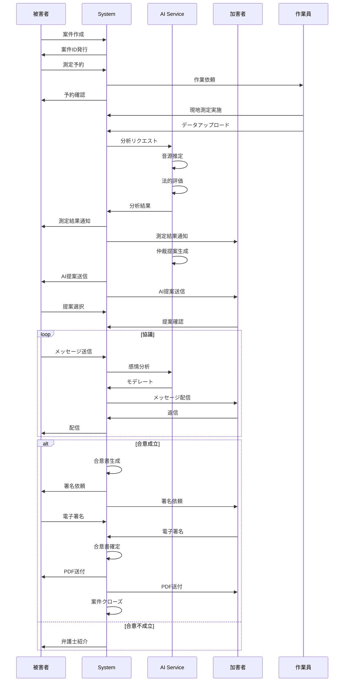

# AI騒音仲裁支援サービス - 詳細仕様書
## ZENBU Mediator - Version 1.0

**作成日**: 2026年1月25日
**最終更新**: 2026年1月25日
**ステータス**: Draft

---

## 目次

1. [システム概要](#1-システム概要)
2. [画面仕様](#2-画面仕様)
3. [API仕様](#3-api仕様)
4. [データモデル](#4-データモデル)
5. [処理フロー](#5-処理フロー)
6. [AI処理仕様](#6-ai処理仕様)
7. [セキュリティ仕様](#7-セキュリティ仕様)
8. [エラーハンドリング](#8-エラーハンドリング)
9. [テスト仕様](#9-テスト仕様)

---

## 1. システム概要

### 1.1 システム構成

```
┌──────────────────────────────────────────────────┐
│              クライアント層                        │
├──────────────────────────────────────────────────┤
│                                                  │
│  ┌─────────────┐  ┌─────────────┐              │
│  │  Web App    │  │ Mobile App  │              │
│  │  (Next.js)  │  │(React Native)│              │
│  └──────┬──────┘  └──────┬──────┘              │
│         │                 │                      │
└─────────┼─────────────────┼──────────────────────┘
          │                 │
          └────────┬────────┘
                   │
┌──────────────────┴──────────────────────────────┐
│           API Gateway Layer                     │
├─────────────────────────────────────────────────┤
│  AWS API Gateway + AWS Cognito                 │
│  - 認証・認可                                    │
│  - レート制限                                    │
│  - ログ記録                                      │
└──────────────────┬──────────────────────────────┘
                   │
┌──────────────────┴──────────────────────────────┐
│          Application Layer (ECS Fargate)        │
├─────────────────────────────────────────────────┤
│                                                 │
│  ┌──────────────┐  ┌──────────────┐           │
│  │ Auth Service │  │ Case Service │           │
│  │  (Node.js)   │  │  (Node.js)   │           │
│  └──────────────┘  └──────────────┘           │
│                                                 │
│  ┌──────────────┐  ┌──────────────┐           │
│  │Measurement   │  │AI Analysis   │           │
│  │Service       │  │Service       │           │
│  │  (Node.js)   │  │  (Python)    │           │
│  └──────────────┘  └──────────────┘           │
│                                                 │
│  ┌──────────────┐  ┌──────────────┐           │
│  │Mediation     │  │Report        │           │
│  │Service (AI)  │  │Service       │           │
│  │  (Python)    │  │  (Node.js)   │           │
│  └──────────────┘  └──────────────┘           │
│                                                 │
│  ┌──────────────┐  ┌──────────────┐           │
│  │Payment       │  │Notification  │           │
│  │Service       │  │Service       │           │
│  │  (Node.js)   │  │  (Node.js)   │           │
│  └──────────────┘  └──────────────┘           │
│                                                 │
└──────────────────┬──────────────────────────────┘
                   │
┌──────────────────┴──────────────────────────────┐
│              Data Layer                         │
├─────────────────────────────────────────────────┤
│                                                 │
│  ┌──────────────┐  ┌──────────────┐           │
│  │PostgreSQL    │  │MongoDB       │           │
│  │(RDS)         │  │(DocumentDB)  │           │
│  │- 構造化データ │  │- ログ・履歴   │           │
│  └──────────────┘  └──────────────┘           │
│                                                 │
│  ┌──────────────┐  ┌──────────────┐           │
│  │Redis         │  │S3            │           │
│  │(ElastiCache) │  │- ファイル保存 │           │
│  │- セッション   │  │- 音声・PDF    │           │
│  └──────────────┘  └──────────────┘           │
│                                                 │
└──────────────────┬──────────────────────────────┘
                   │
┌──────────────────┴──────────────────────────────┐
│            External Services                    │
├─────────────────────────────────────────────────┤
│  OpenAI API  │ Stripe  │ Twilio │ SendGrid    │
└─────────────────────────────────────────────────┘
```

### 1.2 技術スタック

#### フロントエンド
```yaml
Web:
  Framework: Next.js 14
  Language: TypeScript 5.3
  UI Library: Material-UI 5.15
  State Management: Zustand
  Form: React Hook Form
  Validation: Zod
  HTTP Client: Axios

Mobile:
  Framework: React Native (Expo SDK 50)
  Language: TypeScript 5.3
  UI Library: React Native Paper
  Navigation: React Navigation 6
  State: Redux Toolkit
```

#### バックエンド
```yaml
API Services:
  Language: Node.js 20 (Express) / Python 3.11 (FastAPI)
  Authentication: AWS Cognito
  API Gateway: AWS API Gateway
  Container: Docker
  Orchestration: ECS Fargate

AI/ML:
  LLM: OpenAI GPT-4
  Audio Analysis: librosa, scipy
  ML Framework: TensorFlow 2.15
  Image: DALL-E 3 (オプション)
```

#### データベース・ストレージ
```yaml
Relational DB:
  Engine: PostgreSQL 15
  Service: AWS RDS (Multi-AZ)
  ORM: Prisma

Document DB:
  Engine: MongoDB 6
  Service: AWS DocumentDB

Cache:
  Engine: Redis 7
  Service: AWS ElastiCache

Object Storage:
  Service: AWS S3
  CDN: CloudFront
```

#### インフラ
```yaml
Cloud: AWS
IaC: Terraform
CI/CD: GitHub Actions
Monitoring: Datadog
Logging: CloudWatch Logs
APM: New Relic
```

---

## 2. 画面仕様

### 2.1 画面一覧

| 画面ID | 画面名 | URL | 権限 |
|--------|--------|-----|------|
| **S001** | ログイン | /login | Public |
| **S002** | ユーザー登録 | /register | Public |
| **S003** | ダッシュボード | /dashboard | Authenticated |
| **S004** | 案件一覧 | /cases | Authenticated |
| **S005** | 案件詳細 | /cases/:id | Case Member |
| **S006** | 案件作成 | /cases/new | Authenticated |
| **S007** | 測定予約 | /cases/:id/schedule | Case Member |
| **S008** | 測定結果 | /cases/:id/result | Case Member |
| **S009** | AI仲裁提案 | /cases/:id/mediation | Case Member |
| **S010** | 協議室 | /cases/:id/chat | Case Member |
| **S011** | 合意書作成 | /cases/:id/agreement | Case Member |
| **S012** | 電子署名 | /cases/:id/sign | Case Member |
| **S013** | 設定 | /settings | Authenticated |
| **S014** | 管理者画面 | /admin | Admin |

### 2.2 画面詳細仕様

#### S001: ログイン画面

**目的**: ユーザー認証

**レイアウト:**
```
┌────────────────────────────────────┐
│        ZENBU Mediator             │
│    AI騒音仲裁支援サービス          │
│                                    │
│  ┌──────────────────────────────┐ │
│  │  メールアドレス              │ │
│  │  [                        ]  │ │
│  └──────────────────────────────┘ │
│                                    │
│  ┌──────────────────────────────┐ │
│  │  パスワード                  │ │
│  │  [                        ]  │ │
│  └──────────────────────────────┘ │
│                                    │
│  [ ] ログイン状態を保持            │
│                                    │
│  ┌──────────────────────────────┐ │
│  │      ログイン                │ │
│  └──────────────────────────────┘ │
│                                    │
│  パスワードを忘れた方              │
│  新規登録はこちら                  │
│                                    │
│  ───── または ─────               │
│                                    │
│  [G] Googleでログイン              │
│  [L] LINEでログイン                │
│                                    │
└────────────────────────────────────┘
```

**入力項目:**
| 項目名 | 必須 | 型 | 検証ルール |
|--------|------|-----|-----------|
| email | ○ | string | メール形式、最大255文字 |
| password | ○ | string | 最小8文字 |
| remember_me | - | boolean | - |

**バリデーション:**
- メールアドレス形式チェック
- 5回連続失敗でアカウントロック（30分）

**API呼び出し:**
- POST `/api/v1/auth/login`

**画面遷移:**
- 成功: `/dashboard`
- 失敗: エラーメッセージ表示

---

#### S003: ダッシュボード

**目的**: ユーザーの案件状況を一覧表示

**レイアウト:**
```
┌─────────────────────────────────────────────────┐
│ [ロゴ]  ダッシュボード    [通知🔔]  [👤 田中太郎] │
├─────────────────────────────────────────────────┤
│                                                 │
│  ┌────────────────┐  ┌────────────────┐        │
│  │ 進行中の案件    │  │ 未読通知        │        │
│  │     3件        │  │     5件         │        │
│  └────────────────┘  └────────────────┘        │
│                                                 │
│  ━━━━━━━━━━━━━━━━━━━━━━━━━━━━━━━━━━         │
│                                                 │
│  案件一覧                    [+ 新規案件作成]   │
│                                                 │
│  ┌───────────────────────────────────────────┐ │
│  │ 📋 案件 #001                              │ │
│  │ 上階からの深夜の足音                      │ │
│  │ ステータス: 測定完了 → AI分析中           │ │
│  │ 更新: 2時間前                             │ │
│  │ [詳細を見る]                              │ │
│  └───────────────────────────────────────────┘ │
│                                                 │
│  ┌───────────────────────────────────────────┐ │
│  │ 📋 案件 #002                              │ │
│  │ 隣室からの楽器音                          │ │
│  │ ステータス: 協議中                        │ │
│  │ 未読メッセージ: 2件                       │ │
│  │ [詳細を見る]                              │ │
│  └───────────────────────────────────────────┘ │
│                                                 │
└─────────────────────────────────────────────────┘
```

**表示データ:**
- 進行中案件数
- 未読通知数
- 案件リスト（最新5件）

**API呼び出し:**
- GET `/api/v1/cases?status=active&limit=5`
- GET `/api/v1/notifications?unread=true`

---

#### S006: 案件作成画面

**レイアウト:**
```
┌─────────────────────────────────────────────────┐
│ 新規案件作成                                     │
├─────────────────────────────────────────────────┤
│                                                 │
│  STEP 1/3: 基本情報                             │
│  ━━━━━━━━━━━━━━━━━━━━━━━━━━━━━━━━━━         │
│                                                 │
│  案件タイトル*                                  │
│  [                                          ]   │
│                                                 │
│  騒音の種類*                                    │
│  ( ) 足音                                       │
│  ( ) 楽器音                                     │
│  ( ) 話し声・叫び声                             │
│  ( ) 家電音（洗濯機・掃除機等）                 │
│  ( ) その他 [                    ]              │
│                                                 │
│  発生時間帯* (複数選択可)                       │
│  [ ] 早朝（6-9時）                              │
│  [ ] 日中（9-18時）                             │
│  [ ] 夕方（18-22時）                            │
│  [ ] 深夜（22-6時）                             │
│                                                 │
│  発生頻度*                                      │
│  ( ) 毎日                                       │
│  ( ) 週に数回                                   │
│  ( ) 週末のみ                                   │
│  ( ) 不定期                                     │
│                                                 │
│  継続期間*                                      │
│  いつから: [2026/01/01] （カレンダー）          │
│                                                 │
│  詳細説明（任意、最大1,000文字）                │
│  ┌─────────────────────────────────────┐       │
│  │                                     │       │
│  │                                     │       │
│  └─────────────────────────────────────┘       │
│  残り: 1000文字                                 │
│                                                 │
│  証拠ファイル（任意、最大5ファイル）            │
│  [📎 ファイルを選択]                            │
│                                                 │
│  [キャンセル]              [次へ STEP 2 →]     │
│                                                 │
└─────────────────────────────────────────────────┘
```

**入力項目:**
| 項目名 | 必須 | 型 | 検証ルール |
|--------|------|-----|-----------|
| title | ○ | string | 最小5文字、最大100文字 |
| noise_type | ○ | enum | 'footsteps','music','voice','appliance','other' |
| time_slots | ○ | array | 最低1つ選択 |
| frequency | ○ | enum | 'daily','weekly','weekend','irregular' |
| start_date | ○ | date | 過去の日付、最大1年前まで |
| description | - | string | 最大1,000文字 |
| files | - | file[] | 最大5ファイル、各10MB以下 |

**バリデーション:**
- ファイル形式: jpg, png, mp4, mp3, wav
- ファイルサイズ合計: 50MB以下

**API呼び出し:**
- POST `/api/v1/cases`
- POST `/api/v1/cases/:id/files`（ファイルアップロード）

---

#### S009: AI仲裁提案画面

**レイアウト:**
```
┌─────────────────────────────────────────────────┐
│ 案件 #001: AI仲裁提案                            │
├─────────────────────────────────────────────────┤
│                                                 │
│  測定結果サマリー                               │
│  ┌──────────────────────────────────────────┐   │
│  │ 平均騒音レベル:  52.3 dB                 │   │
│  │ 環境基準:        45 dB (夜間)            │   │
│  │ 超過量:          +7.3 dB  ⚠️             │   │
│  │ 主な音源:        足音 (85%)              │   │
│  └──────────────────────────────────────────┘   │
│                                                 │
│  AIによる解決案（3パターン）                    │
│  ━━━━━━━━━━━━━━━━━━━━━━━━━━━━━━━━━━         │
│                                                 │
│  ┌──────────────────────────────────────────┐   │
│  │ 📌 パターンA: 改善重視                   │   │
│  │ 実現可能性: ★★★★☆ (80%)                │   │
│  │ 公平性:     ★★★★★ (95%)                │   │
│  │ 再発防止:   ★★★★☆ (85%)                │   │
│  │                                          │   │
│  │ 【合意内容】                             │   │
│  │ 1. 加害者は防音マット（厚さ5mm以上）を   │   │
│  │    全面に設置（2週間以内）               │   │
│  │ 2. 深夜23時以降はスリッパを着用          │   │
│  │ 3. 被害者は1ヶ月様子見                   │   │
│  │ 4. 改善なしの場合、再測定（管理会社立会）│   │
│  │                                          │   │
│  │ 【費用負担】                             │   │
│  │ 防音マット: 加害者負担（約15,000円）     │   │
│  │                                          │   │
│  │ [このパターンを選択] [詳細を見る]        │   │
│  └──────────────────────────────────────────┘   │
│                                                 │
│  ┌──────────────────────────────────────────┐   │
│  │ 📌 パターンB: 補償重視                   │   │
│  │ 実現可能性: ★★★★★ (90%)                │   │
│  │ 公平性:     ★★★☆☆ (70%)                │   │
│  │ 再発防止:   ★★★☆☆ (65%)                │   │
│  │                                          │   │
│  │ 【合意内容】                             │   │
│  │ 1. 加害者は被害者に迷惑料2万円を支払い   │   │
│  │ 2. 防音マット設置（加害者負担）          │   │
│  │ 3. 書面での謝罪                          │   │
│  │                                          │   │
│  │ [このパターンを選択] [詳細を見る]        │   │
│  └──────────────────────────────────────────┘   │
│                                                 │
│  ┌──────────────────────────────────────────┐   │
│  │ 📌 パターンC: 住み分け重視               │   │
│  │ 実現可能性: ★★☆☆☆ (40%)                │   │
│  │ 公平性:     ★★★★☆ (85%)                │   │
│  │ 再発防止:   ★★★★★ (100%)               │   │
│  │                                          │   │
│  │ 【合意内容】                             │   │
│  │ 1. 加害者の部屋移動を管理会社が斡旋      │   │
│  │ 2. 移動費用を三者で分担（各1/3）         │   │
│  │ 3. 双方が合意書に署名                    │   │
│  │                                          │   │
│  │ [このパターンを選択] [詳細を見る]        │   │
│  └──────────────────────────────────────────┘   │
│                                                 │
│  💡 AIアドバイス:                               │
│  過去の類似ケース87件の分析から、パターンAが    │
│  最も合意に至りやすく、再発も少ない傾向です。   │
│                                                 │
│  [カスタム案を作成]         [協議室で話し合う]  │
│                                                 │
└─────────────────────────────────────────────────┘
```

**表示データ:**
- 測定結果サマリー
- AI生成の解決案（3パターン）
- 各パターンの評価指標
- 過去の類似ケースからのアドバイス

**API呼び出し:**
- GET `/api/v1/cases/:id/mediation-proposals`

**ユーザーアクション:**
- パターン選択 → 協議室へ遷移
- カスタム案作成 → 編集画面へ
- 詳細表示 → モーダルで詳細表示

---

#### S010: 協議室（チャット）

**レイアウト:**
```
┌─────────────────────────────────────────────────┐
│ 案件 #001: 協議室                                │
│ 参加者: 田中太郎(被害者), 佐藤花子(加害者), AI  │
├─────────────────────────────────────────────────┤
│                                                 │
│  ┌───────────────────────────────────────────┐  │
│  │ 🤖 AIモデレーター            10:30        │  │
│  │ 測定結果をもとに、3つの解決案を提示しま  │  │
│  │ した。まずはパターンAについて、ご意見を  │  │
│  │ お聞かせください。                        │  │
│  └───────────────────────────────────────────┘  │
│                                                 │
│  ┌───────────────────────────────────────────┐  │
│  │              佐藤花子 (加害者)  10:32    │  │
│  │              防音マット、設置します。   │  │
│  │              どれくらいの厚さが必要ですか？│  │
│  └───────────────────────────────────────────┘  │
│                                                 │
│  ┌───────────────────────────────────────────┐  │
│  │ 🤖 AIモデレーター            10:33        │  │
│  │ 環境省のガイドラインでは、集合住宅の場合 │  │
│  │ 5mm以上の厚さが推奨されています。Amazon  │  │
│  │ で約15,000円で購入可能です。             │  │
│  │ [商品リンク]                              │  │
│  └───────────────────────────────────────────┘  │
│                                                 │
│  ┌───────────────────────────────────────────┐  │
│  │ 田中太郎 (被害者)            10:35        │  │
│  │ ありがとうございます。設置いただけるなら │  │
│  │ 1ヶ月様子を見させてください。            │  │
│  └───────────────────────────────────────────┘  │
│                                                 │
│  ━━━━━━━━━━━━━━━━━━━━━━━━━━━━━━━━━━      │
│                                                 │
│  ┌─────────────────────────────────────────┐   │
│  │ メッセージを入力...                      │   │
│  └─────────────────────────────────────────┘   │
│  [📎]  [😊]                      [送信]         │
│                                                 │
│  ───────────────────────────────────────────  │
│                                                 │
│  💡 AI提案: 双方が前向きですね！このまま進めて  │
│  よろしければ「合意書を作成」ボタンを押して     │
│  ください。                                     │
│                                                 │
│  [合意書を作成]                                 │
│                                                 │
└─────────────────────────────────────────────────┘
```

**機能:**
- リアルタイムチャット（WebSocket）
- AIモデレーターの自動介入
- 感情分析（炎上検知）
- 不適切発言のフィルタリング
- ファイル添付
- 既読表示

**API呼び出し:**
- WebSocket: `wss://api.zenbu.com/ws/cases/:id/chat`
- POST `/api/v1/cases/:id/messages`
- GET `/api/v1/cases/:id/messages?limit=50&offset=0`

---

## 3. API仕様

### 3.1 認証API

#### POST /api/v1/auth/register

**説明**: ユーザー新規登録

**Request:**
```json
{
  "email": "tanaka@example.com",
  "password": "SecureP@ss123",
  "name": "田中太郎",
  "phone": "+819012345678",
  "user_type": "victim", // "victim" | "perpetrator" | "manager"
  "property_address": "東京都渋谷区xxx 1-2-3",
  "room_number": "302"
}
```

**Response (201):**
```json
{
  "user_id": "usr_1a2b3c4d5e6f",
  "email": "tanaka@example.com",
  "name": "田中太郎",
  "user_type": "victim",
  "created_at": "2026-01-25T10:30:00Z",
  "verification_required": true
}
```

**Errors:**
- 400: バリデーションエラー
- 409: メールアドレス重複

---

#### POST /api/v1/auth/login

**説明**: ログイン

**Request:**
```json
{
  "email": "tanaka@example.com",
  "password": "SecureP@ss123"
}
```

**Response (200):**
```json
{
  "access_token": "eyJhbGciOiJIUzI1NiIsInR5cCI6IkpXVCJ9...",
  "refresh_token": "eyJhbGciOiJIUzI1NiIsInR5cCI6IkpXVCJ9...",
  "expires_in": 3600,
  "user": {
    "user_id": "usr_1a2b3c4d5e6f",
    "email": "tanaka@example.com",
    "name": "田中太郎",
    "user_type": "victim"
  }
}
```

**Errors:**
- 401: 認証失敗
- 403: アカウントロック

---

### 3.2 案件API

#### POST /api/v1/cases

**説明**: 案件新規作成

**Request:**
```json
{
  "title": "上階からの深夜の足音",
  "noise_type": "footsteps",
  "time_slots": ["night"],
  "frequency": "daily",
  "start_date": "2026-01-01",
  "description": "毎晩23時以降に上階から...",
  "perpetrator_info": {
    "room_number": "402",
    "name": "佐藤花子" // 任意
  },
  "urgency": "medium"
}
```

**Response (201):**
```json
{
  "case_id": "case_abc123def456",
  "title": "上階からの深夜の足音",
  "status": "created",
  "created_by": "usr_1a2b3c4d5e6f",
  "created_at": "2026-01-25T10:30:00Z",
  "next_step": {
    "action": "schedule_measurement",
    "url": "/api/v1/cases/case_abc123def456/schedule"
  }
}
```

---

#### GET /api/v1/cases

**説明**: 案件一覧取得

**Query Parameters:**
| パラメータ | 必須 | 型 | 説明 |
|-----------|------|-----|------|
| status | - | enum | 'created','measurement_scheduled','analyzing','mediating','agreement','closed' |
| limit | - | integer | デフォルト: 20、最大: 100 |
| offset | - | integer | デフォルト: 0 |
| sort | - | string | 'created_at' | 'updated_at' | 'status' |
| order | - | enum | 'asc' | 'desc' (デフォルト) |

**Response (200):**
```json
{
  "cases": [
    {
      "case_id": "case_abc123def456",
      "title": "上階からの深夜の足音",
      "status": "analyzing",
      "created_at": "2026-01-25T10:30:00Z",
      "updated_at": "2026-01-26T14:20:00Z",
      "parties": {
        "victim": {
          "user_id": "usr_1a2b3c4d5e6f",
          "name": "田中太郎",
          "room": "302"
        },
        "perpetrator": {
          "user_id": "usr_7g8h9i0j1k2l",
          "name": "佐藤花子",
          "room": "402"
        }
      },
      "unread_messages": 2
    }
  ],
  "total": 15,
  "limit": 20,
  "offset": 0
}
```

---

#### GET /api/v1/cases/:case_id

**説明**: 案件詳細取得

**Response (200):**
```json
{
  "case_id": "case_abc123def456",
  "title": "上階からの深夜の足音",
  "description": "毎晩23時以降に上階から...",
  "noise_type": "footsteps",
  "time_slots": ["night"],
  "frequency": "daily",
  "start_date": "2026-01-01",
  "status": "analyzing",
  "urgency": "medium",

  "parties": {
    "victim": {
      "user_id": "usr_1a2b3c4d5e6f",
      "name": "田中太郎",
      "room": "302",
      "email": "tanaka@example.com",
      "phone": "+819012345678"
    },
    "perpetrator": {
      "user_id": "usr_7g8h9i0j1k2l",
      "name": "佐藤花子",
      "room": "402",
      "email": "sato@example.com"
    },
    "manager": {
      "company_id": "cmp_xyz789",
      "company_name": "株式会社ABC管理",
      "representative": "山田次郎"
    }
  },

  "timeline": [
    {
      "timestamp": "2026-01-25T10:30:00Z",
      "event": "case_created",
      "actor": "田中太郎",
      "description": "案件が作成されました"
    },
    {
      "timestamp": "2026-01-25T11:00:00Z",
      "event": "measurement_scheduled",
      "actor": "System",
      "description": "測定が予約されました（1/27 14:00）"
    }
  ],

  "measurement": {
    "measurement_id": "meas_123abc",
    "scheduled_at": "2026-01-27T14:00:00Z",
    "status": "completed",
    "worker": {
      "name": "鈴木作業員",
      "phone": "+819087654321"
    }
  },

  "analysis": {
    "average_db": 52.3,
    "max_db": 68.5,
    "min_db": 38.2,
    "environmental_standard": 45,
    "exceeds": true,
    "excess_amount": 7.3,
    "sound_sources": [
      {"type": "footsteps", "confidence": 0.85}
    ],
    "legal_assessment": {
      "tolerance_exceeded": "likely",
      "confidence": 0.75
    }
  },

  "created_at": "2026-01-25T10:30:00Z",
  "updated_at": "2026-01-27T16:30:00Z"
}
```

---

### 3.3 AI分析API

#### POST /api/v1/cases/:case_id/analyze

**説明**: 測定データのAI分析を実行

**Request:**
```json
{
  "measurement_id": "meas_123abc"
}
```

**Response (202 Accepted):**
```json
{
  "job_id": "job_analyze_xyz789",
  "status": "processing",
  "estimated_completion": "2026-01-27T16:35:00Z"
}
```

**非同期処理:**
- 完了時にWebhook通知
- または GET `/api/v1/jobs/:job_id` でポーリング

---

#### GET /api/v1/cases/:case_id/mediation-proposals

**説明**: AI仲裁提案の取得

**Response (200):**
```json
{
  "case_id": "case_abc123def456",
  "proposals": [
    {
      "proposal_id": "prop_pattern_a",
      "pattern": "improvement_focused",
      "title": "改善重視",
      "feasibility": 0.80,
      "fairness": 0.95,
      "recurrence_prevention": 0.85,
      "acceptance_probability": 0.72,

      "agreement_items": [
        {
          "item_id": "item_1",
          "description": "加害者は防音マット（厚さ5mm以上）を全面に設置",
          "responsible_party": "perpetrator",
          "deadline_days": 14,
          "estimated_cost": 15000
        },
        {
          "item_id": "item_2",
          "description": "深夜23時以降はスリッパを着用",
          "responsible_party": "perpetrator",
          "deadline_days": 0
        },
        {
          "item_id": "item_3",
          "description": "被害者は1ヶ月様子見",
          "responsible_party": "victim",
          "deadline_days": 30
        },
        {
          "item_id": "item_4",
          "description": "改善なしの場合、管理会社立会で再測定",
          "responsible_party": "all",
          "deadline_days": 30,
          "conditional": true
        }
      ],

      "cost_breakdown": {
        "total": 15000,
        "victim": 0,
        "perpetrator": 15000,
        "manager": 0
      },

      "similar_cases": {
        "count": 87,
        "success_rate": 0.74
      }
    },
    {
      "proposal_id": "prop_pattern_b",
      "pattern": "compensation_focused",
      "title": "補償重視",
      // ...
    },
    {
      "proposal_id": "prop_pattern_c",
      "pattern": "relocation_focused",
      "title": "住み分け重視",
      // ...
    }
  ],

  "ai_recommendation": {
    "recommended_proposal_id": "prop_pattern_a",
    "reasoning": "過去の類似ケース87件の分析から、パターンAが最も合意に至りやすく、再発も少ない傾向です。"
  }
}
```

---

### 3.4 協議室API

#### WebSocket /ws/cases/:case_id/chat

**接続:**
```javascript
const ws = new WebSocket('wss://api.zenbu.com/ws/cases/case_abc123def456/chat?token=xxx');
```

**メッセージ送信:**
```json
{
  "type": "message",
  "content": "防音マット、設置します。",
  "sender_id": "usr_7g8h9i0j1k2l"
}
```

**メッセージ受信:**
```json
{
  "type": "message",
  "message_id": "msg_aaa111bbb222",
  "sender": {
    "user_id": "usr_7g8h9i0j1k2l",
    "name": "佐藤花子",
    "role": "perpetrator"
  },
  "content": "防音マット、設置します。",
  "timestamp": "2026-01-28T10:32:00Z",
  "read_by": []
}
```

**AIモデレーター介入:**
```json
{
  "type": "ai_moderation",
  "message_id": "msg_ai_123",
  "sender": {
    "user_id": "ai_moderator",
    "name": "AIモデレーター",
    "role": "ai"
  },
  "content": "環境省のガイドラインでは、集合住宅の場合5mm以上の厚さが推奨されています。",
  "context": {
    "trigger": "question_detected",
    "keywords": ["厚さ", "必要"]
  },
  "timestamp": "2026-01-28T10:33:00Z"
}
```

**イベント通知:**
```json
{
  "type": "event",
  "event_type": "user_joined",
  "user": {
    "user_id": "usr_1a2b3c4d5e6f",
    "name": "田中太郎"
  },
  "timestamp": "2026-01-28T10:30:00Z"
}
```

---

## 4. データモデル

### 4.1 ERD（Entity Relationship Diagram）

```
┌──────────────┐       ┌──────────────┐       ┌──────────────┐
│    users     │       │    cases     │       │measurements  │
├──────────────┤       ├──────────────┤       ├──────────────┤
│ id (PK)      │       │ id (PK)      │       │ id (PK)      │
│ email        │───┐   │ title        │   ┌───│ case_id (FK) │
│ password_hash│   │   │ description  │   │   │ scheduled_at │
│ name         │   │   │ noise_type   │   │   │ status       │
│ phone        │   │   │ status       │   │   │ worker_id    │
│ user_type    │   │   │ created_by───┼───┘   │ audio_file   │
│ ...          │   │   │ victim_id────┼───┐   │ ...          │
└──────────────┘   │   │ perpetrator_id   │   └───┬──────────┘
                   │   │ manager_id   │   │       │
                   └───│ ...          │   │       │
                       └──────────────┘   │       │
                              │           │       │
                              │           │       │
               ┌──────────────┴────┐      │       │
               │                   │      │       │
               ▼                   ▼      │       ▼
     ┌──────────────┐     ┌──────────────┐  ┌─────────────┐
     │case_parties  │     │  messages    │  │  analysis   │
     ├──────────────┤     ├──────────────┤  ├─────────────┤
     │ case_id (FK) │     │ id (PK)      │  │ id (PK)     │
     │ user_id (FK) │     │ case_id (FK) │  │ measurement │
     │ role         │     │ sender_id    │  │  _id (FK)   │
     │ ...          │     │ content      │  │ average_db  │
     └──────────────┘     │ ...          │  │ max_db      │
                          └──────────────┘  │ ...         │
                                            └─────────────┘
```

### 4.2 テーブル定義

#### users テーブル

```sql
CREATE TABLE users (
  id UUID PRIMARY KEY DEFAULT gen_random_uuid(),
  email VARCHAR(255) UNIQUE NOT NULL,
  password_hash VARCHAR(255) NOT NULL,
  name VARCHAR(100) NOT NULL,
  phone VARCHAR(20) NOT NULL,
  user_type VARCHAR(20) NOT NULL, -- 'victim', 'perpetrator', 'manager', 'admin'
  property_address TEXT,
  room_number VARCHAR(20),
  email_verified BOOLEAN DEFAULT FALSE,
  phone_verified BOOLEAN DEFAULT FALSE,
  created_at TIMESTAMP DEFAULT CURRENT_TIMESTAMP,
  updated_at TIMESTAMP DEFAULT CURRENT_TIMESTAMP,
  last_login_at TIMESTAMP,
  status VARCHAR(20) DEFAULT 'active', -- 'active', 'suspended', 'deleted'

  CONSTRAINT chk_user_type CHECK (user_type IN ('victim', 'perpetrator', 'manager', 'admin'))
);

CREATE INDEX idx_users_email ON users(email);
CREATE INDEX idx_users_user_type ON users(user_type);
```

#### cases テーブル

```sql
CREATE TABLE cases (
  id UUID PRIMARY KEY DEFAULT gen_random_uuid(),
  title VARCHAR(200) NOT NULL,
  description TEXT,
  noise_type VARCHAR(50) NOT NULL,
  time_slots TEXT[] NOT NULL, -- ['morning', 'day', 'evening', 'night']
  frequency VARCHAR(20) NOT NULL, -- 'daily', 'weekly', 'weekend', 'irregular'
  start_date DATE NOT NULL,
  status VARCHAR(50) DEFAULT 'created', -- 'created', 'measurement_scheduled', 'analyzing', 'mediating', 'agreement', 'closed'
  urgency VARCHAR(20) DEFAULT 'medium', -- 'low', 'medium', 'high'

  created_by UUID REFERENCES users(id),
  victim_id UUID REFERENCES users(id),
  perpetrator_id UUID REFERENCES users(id),
  manager_id UUID REFERENCES users(id),

  created_at TIMESTAMP DEFAULT CURRENT_TIMESTAMP,
  updated_at TIMESTAMP DEFAULT CURRENT_TIMESTAMP,
  closed_at TIMESTAMP,

  CONSTRAINT chk_status CHECK (status IN ('created', 'measurement_scheduled', 'analyzing', 'mediating', 'agreement', 'closed')),
  CONSTRAINT chk_urgency CHECK (urgency IN ('low', 'medium', 'high'))
);

CREATE INDEX idx_cases_status ON cases(status);
CREATE INDEX idx_cases_created_by ON cases(created_by);
CREATE INDEX idx_cases_victim_id ON cases(victim_id);
CREATE INDEX idx_cases_created_at ON cases(created_at DESC);
```

#### measurements テーブル

```sql
CREATE TABLE measurements (
  id UUID PRIMARY KEY DEFAULT gen_random_uuid(),
  case_id UUID REFERENCES cases(id),
  scheduled_at TIMESTAMP NOT NULL,
  started_at TIMESTAMP,
  completed_at TIMESTAMP,
  duration_minutes INTEGER,
  status VARCHAR(20) DEFAULT 'scheduled', -- 'scheduled', 'in_progress', 'completed', 'cancelled'
  worker_id UUID REFERENCES users(id),

  audio_file_url TEXT,
  audio_file_size_bytes BIGINT,
  raw_data_url TEXT,

  location_latitude DECIMAL(10, 8),
  location_longitude DECIMAL(11, 8),

  notes TEXT,
  photos_urls TEXT[],

  created_at TIMESTAMP DEFAULT CURRENT_TIMESTAMP,
  updated_at TIMESTAMP DEFAULT CURRENT_TIMESTAMP,

  CONSTRAINT chk_status CHECK (status IN ('scheduled', 'in_progress', 'completed', 'cancelled'))
);

CREATE INDEX idx_measurements_case_id ON measurements(case_id);
CREATE INDEX idx_measurements_scheduled_at ON measurements(scheduled_at);
```

#### analysis テーブル

```sql
CREATE TABLE analysis (
  id UUID PRIMARY KEY DEFAULT gen_random_uuid(),
  measurement_id UUID REFERENCES measurements(id) UNIQUE,
  case_id UUID REFERENCES cases(id),

  average_db DECIMAL(5, 2),
  max_db DECIMAL(5, 2),
  min_db DECIMAL(5, 2),
  std_dev DECIMAL(5, 2),

  environmental_standard DECIMAL(5, 2),
  exceeds_standard BOOLEAN,
  excess_amount DECIMAL(5, 2),

  sound_sources JSONB, -- [{"type": "footsteps", "confidence": 0.85}]

  frequency_analysis JSONB, -- FFT結果

  legal_assessment JSONB, -- {"tolerance_exceeded": "likely", "confidence": 0.75, "precedents": [...]}

  recommendations TEXT[],

  ai_model_version VARCHAR(50),
  processing_time_seconds INTEGER,

  created_at TIMESTAMP DEFAULT CURRENT_TIMESTAMP,
  updated_at TIMESTAMP DEFAULT CURRENT_TIMESTAMP
);

CREATE INDEX idx_analysis_measurement_id ON analysis(measurement_id);
CREATE INDEX idx_analysis_case_id ON analysis(case_id);
```

#### mediation_proposals テーブル

```sql
CREATE TABLE mediation_proposals (
  id UUID PRIMARY KEY DEFAULT gen_random_uuid(),
  case_id UUID REFERENCES cases(id),
  analysis_id UUID REFERENCES analysis(id),

  pattern VARCHAR(50) NOT NULL, -- 'improvement_focused', 'compensation_focused', 'relocation_focused'
  title VARCHAR(100) NOT NULL,

  agreement_items JSONB NOT NULL, -- 合意事項の配列

  feasibility DECIMAL(3, 2), -- 0.00 - 1.00
  fairness DECIMAL(3, 2),
  recurrence_prevention DECIMAL(3, 2),
  acceptance_probability DECIMAL(3, 2),

  cost_breakdown JSONB, -- {"total": 15000, "victim": 0, "perpetrator": 15000, "manager": 0}

  similar_cases_count INTEGER,
  similar_cases_success_rate DECIMAL(3, 2),

  selected BOOLEAN DEFAULT FALSE,
  selected_at TIMESTAMP,
  selected_by UUID REFERENCES users(id),

  created_at TIMESTAMP DEFAULT CURRENT_TIMESTAMP
);

CREATE INDEX idx_mediation_proposals_case_id ON mediation_proposals(case_id);
```

#### messages テーブル

```sql
CREATE TABLE messages (
  id UUID PRIMARY KEY DEFAULT gen_random_uuid(),
  case_id UUID REFERENCES cases(id),
  sender_id UUID REFERENCES users(id),
  sender_type VARCHAR(20) NOT NULL, -- 'user', 'ai', 'system'

  content TEXT NOT NULL,
  message_type VARCHAR(20) DEFAULT 'text', -- 'text', 'file', 'system_event'

  attachments JSONB, -- [{"file_url": "...", "file_name": "...", "file_size": 123}]

  reply_to UUID REFERENCES messages(id),

  read_by JSONB DEFAULT '[]', -- [{"user_id": "xxx", "read_at": "2026-01-28T10:35:00Z"}]

  ai_context JSONB, -- AIメッセージの場合、トリガーや根拠

  created_at TIMESTAMP DEFAULT CURRENT_TIMESTAMP,
  updated_at TIMESTAMP DEFAULT CURRENT_TIMESTAMP,
  deleted_at TIMESTAMP,

  CONSTRAINT chk_sender_type CHECK (sender_type IN ('user', 'ai', 'system'))
);

CREATE INDEX idx_messages_case_id ON messages(case_id);
CREATE INDEX idx_messages_created_at ON messages(created_at);
```

#### agreements テーブル

```sql
CREATE TABLE agreements (
  id UUID PRIMARY KEY DEFAULT gen_random_uuid(),
  case_id UUID REFERENCES cases(id) UNIQUE,
  proposal_id UUID REFERENCES mediation_proposals(id),

  title VARCHAR(200) NOT NULL,
  content TEXT NOT NULL, -- 合意内容（全文）

  pdf_url TEXT,
  word_url TEXT,

  signatures JSONB NOT NULL, -- [{"user_id": "xxx", "signed_at": "...", "ip_address": "...", "signature_hash": "..."}]

  status VARCHAR(20) DEFAULT 'draft', -- 'draft', 'pending_signatures', 'signed', 'executed', 'violated'

  all_signed_at TIMESTAMP,

  violation_reported BOOLEAN DEFAULT FALSE,
  violation_details TEXT,

  created_at TIMESTAMP DEFAULT CURRENT_TIMESTAMP,
  updated_at TIMESTAMP DEFAULT CURRENT_TIMESTAMP,

  CONSTRAINT chk_status CHECK (status IN ('draft', 'pending_signatures', 'signed', 'executed', 'violated'))
);

CREATE INDEX idx_agreements_case_id ON agreements(case_id);
```

---

## 5. 処理フロー

### 5.1 案件作成から合意までの全体フロー



### 5.2 AI分析処理フロー

```
測定データ（音声ファイル）
    ↓
[前処理]
├ ノイズ除去（フィルタリング）
├ サンプリングレート正規化
└ セグメント分割（1秒単位）
    ↓
[統計処理]
├ dB値計算（RMS）
├ 平均/最大/最小/標準偏差
└ 時系列データ生成
    ↓
[周波数解析]
├ FFT（高速フーリエ変換）
├ スペクトログラム生成
└ 周波数帯域別エネルギー計算
    ↓
[音源推定AI]（CNN）
├ スペクトログラムを画像入力
├ 学習済みモデルで推論
└ 音源タイプ + 信頼度出力
    ↓
[法的評価]（GPT-4）
├ 環境基準との比較
├ 受忍限度の判定
├ 判例データベース検索
└ 法的評価文生成
    ↓
[結果JSON生成]
├ 統計データ
├ 音源推定結果
├ 法的評価
└ 推奨対策
    ↓
PostgreSQLに保存
```

### 5.3 AI仲裁提案生成フロー

```python
def generate_mediation_proposals(case_id: str, analysis: dict) -> list:
    """
    AI仲裁提案を生成

    入力:
    - case_id: 案件ID
    - analysis: AI分析結果

    出力:
    - proposals: 提案リスト（3パターン）
    """

    # 1. 類似ケースの検索
    similar_cases = search_similar_cases(
        noise_type=analysis['noise_type'],
        db_level=analysis['average_db'],
        limit=100
    )

    # 2. パターンA生成（改善重視）
    pattern_a = generate_improvement_focused_proposal(
        analysis=analysis,
        similar_cases=similar_cases
    )

    # 3. パターンB生成（補償重視）
    pattern_b = generate_compensation_focused_proposal(
        analysis=analysis,
        similar_cases=similar_cases
    )

    # 4. パターンC生成（住み分け重視）
    pattern_c = generate_relocation_focused_proposal(
        analysis=analysis,
        similar_cases=similar_cases
    )

    # 5. 各パターンの評価
    for proposal in [pattern_a, pattern_b, pattern_c]:
        proposal['feasibility'] = calculate_feasibility(proposal)
        proposal['fairness'] = calculate_fairness(proposal)
        proposal['recurrence_prevention'] = calculate_recurrence_prevention(proposal)
        proposal['acceptance_probability'] = predict_acceptance(proposal, similar_cases)

    # 6. 推奨度でソート
    proposals = sorted(
        [pattern_a, pattern_b, pattern_c],
        key=lambda x: x['acceptance_probability'],
        reverse=True
    )

    return proposals


def generate_improvement_focused_proposal(analysis: dict, similar_cases: list) -> dict:
    """改善重視の提案を生成"""

    # GPT-4に提案生成を依頼
    prompt = f"""
    以下の騒音測定結果をもとに、「改善重視」の解決案を生成してください。

    測定結果:
    - 平均騒音レベル: {analysis['average_db']} dB
    - 環境基準: {analysis['environmental_standard']} dB
    - 超過量: {analysis['excess_amount']} dB
    - 主な音源: {analysis['sound_sources'][0]['type']} ({analysis['sound_sources'][0]['confidence']*100:.0f}%)

    類似ケース:
    {format_similar_cases(similar_cases[:10])}

    以下の形式で提案を生成してください:

    1. 加害者の対応（具体的な改善策）
    2. 被害者の対応（様子見期間等）
    3. 管理会社の対応（必要に応じて）
    4. 費用負担
    5. 履行期限
    6. 改善されない場合の措置

    JSON形式で出力してください。
    """

    response = openai.ChatCompletion.create(
        model="gpt-4",
        messages=[
            {"role": "system", "content": "あなたは騒音トラブル解決の専門家です。公平で実現可能な提案を作成します。"},
            {"role": "user", "content": prompt}
        ],
        temperature=0.3
    )

    proposal = json.loads(response.choices[0].message.content)

    # パターン固有の設定
    proposal['pattern'] = 'improvement_focused'
    proposal['title'] = '改善重視'

    return proposal


def predict_acceptance(proposal: dict, similar_cases: list) -> float:
    """
    提案の受容確率を予測

    過去の類似ケースから機械学習で予測
    """
    # 特徴量抽出
    features = extract_features(proposal)

    # 学習済みモデルで予測
    model = load_model('acceptance_prediction_model.pkl')
    probability = model.predict_proba([features])[0][1]

    return round(probability, 2)
```

---

## 6. AI処理仕様

### 6.1 音源推定AIモデル

#### モデルアーキテクチャ

```python
import tensorflow as tf
from tensorflow.keras import layers, models

def create_sound_source_model(input_shape=(128, 128, 1), num_classes=10):
    """
    音源推定CNNモデル

    入力: スペクトログラム画像 (128x128x1)
    出力: 音源タイプの確率分布 (10クラス)
    """
    model = models.Sequential([
        # 畳み込み層 1
        layers.Conv2D(32, (3, 3), activation='relu', input_shape=input_shape),
        layers.MaxPooling2D((2, 2)),
        layers.BatchNormalization(),
        layers.Dropout(0.25),

        # 畳み込み層 2
        layers.Conv2D(64, (3, 3), activation='relu'),
        layers.MaxPooling2D((2, 2)),
        layers.BatchNormalization(),
        layers.Dropout(0.25),

        # 畳み込み層 3
        layers.Conv2D(128, (3, 3), activation='relu'),
        layers.MaxPooling2D((2, 2)),
        layers.BatchNormalization(),
        layers.Dropout(0.25),

        # 全結合層
        layers.Flatten(),
        layers.Dense(256, activation='relu'),
        layers.Dropout(0.5),
        layers.Dense(num_classes, activation='softmax')
    ])

    model.compile(
        optimizer='adam',
        loss='categorical_crossentropy',
        metrics=['accuracy']
    )

    return model
```

#### クラス定義

```python
SOUND_CLASSES = {
    0: "footsteps",      # 足音
    1: "music",          # 楽器・音楽
    2: "voice",          # 話し声
    3: "appliance",      # 家電音
    4: "impact",         # 衝撃音
    5: "door",           # ドアの開閉
    6: "furniture",      # 家具の移動
    7: "pet",            # ペットの鳴き声
    8: "plumbing",       # 給排水音
    9: "other"           # その他
}
```

#### 推論処理

```python
import librosa
import numpy as np

def predict_sound_source(audio_file_path: str) -> list:
    """
    音源を推定

    引数:
    - audio_file_path: 音声ファイルのパス

    戻り値:
    - predictions: [{"type": "footsteps", "confidence": 0.85}, ...]
    """
    # 音声ファイル読み込み
    y, sr = librosa.load(audio_file_path, sr=22050)

    # スペクトログラム生成
    S = librosa.feature.melspectrogram(y=y, sr=sr, n_mels=128)
    S_db = librosa.power_to_db(S, ref=np.max)

    # 画像サイズ正規化 (128x128)
    S_db_resized = cv2.resize(S_db, (128, 128))
    S_db_normalized = (S_db_resized + 80) / 80  # 正規化

    # バッチ次元追加
    input_data = np.expand_dims(S_db_normalized, axis=(0, -1))

    # モデル読み込み
    model = tf.keras.models.load_model('sound_source_model.h5')

    # 推論
    probabilities = model.predict(input_data)[0]

    # 結果を整形
    predictions = []
    for class_id, prob in enumerate(probabilities):
        if prob > 0.05:  # 5%以上の確率のみ
            predictions.append({
                "type": SOUND_CLASSES[class_id],
                "confidence": round(float(prob), 2)
            })

    # 確率の高い順にソート
    predictions.sort(key=lambda x: x['confidence'], reverse=True)

    return predictions
```

### 6.2 GPT-4による法的評価

```python
import openai

def generate_legal_assessment(analysis: dict, case_info: dict) -> dict:
    """
    GPT-4で法的評価を生成

    引数:
    - analysis: 測定・分析結果
    - case_info: 案件情報

    戻り値:
    - legal_assessment: 法的評価
    """

    prompt = f"""
    以下の騒音測定結果について、法的な評価を行ってください。

    【測定結果】
    - 測定日時: {analysis['measured_at']}
    - 測定場所: {case_info['property_address']} {case_info['room_number']}
    - 平均騒音レベル: {analysis['average_db']} dB
    - 最大騒音レベル: {analysis['max_db']} dB
    - 環境基準: {analysis['environmental_standard']} dB（{case_info['area_type']}地域・夜間）
    - 基準超過量: {analysis['excess_amount']} dB
    - 主な音源: {analysis['sound_sources'][0]['type']} (信頼度{analysis['sound_sources'][0]['confidence']*100:.0f}%)
    - 発生時間帯: {case_info['time_slots']}
    - 継続期間: {case_info['start_date']}から

    【評価項目】
    1. 受忍限度の評価
       - 環境基準との比較
       - 発生時間帯の考慮
       - 継続性の評価
       - 総合判断（「超過の可能性が高い」「グレーゾーン」「範囲内」）

    2. 法的根拠
       - 関連法令（環境基本法、騒音規制法等）
       - 参考判例の検索と引用

    3. 信頼度
       - この評価の確信度（0-1）

    JSON形式で出力してください:
    {{
      "tolerance_exceeded": "likely" | "gray_zone" | "within",
      "confidence": 0.75,
      "reasoning": "...",
      "legal_basis": [...],
      "precedents": [...]
    }}
    """

    response = openai.ChatCompletion.create(
        model="gpt-4",
        messages=[
            {
                "role": "system",
                "content": "あなたは騒音問題に詳しい法律の専門家です。客観的で正確な法的評価を行います。"
            },
            {
                "role": "user",
                "content": prompt
            }
        ],
        temperature=0.2  # 低温度で一貫性を確保
    )

    legal_assessment = json.loads(response.choices[0].message.content)

    return legal_assessment
```

### 6.3 AIモデレーター（協議室）

```python
def ai_moderate_chat(message: dict, case_context: dict) -> dict:
    """
    協議室のメッセージをAIがモデレート

    引数:
    - message: ユーザーメッセージ
    - case_context: 案件のコンテキスト

    戻り値:
    - moderation_result: モデレート結果
    """

    # 1. 感情分析（ネガティブ度チェック）
    sentiment = analyze_sentiment(message['content'])

    # 2. 不適切表現チェック
    inappropriate = check_inappropriate_content(message['content'])

    # 3. 質問検出
    is_question = detect_question(message['content'])

    # 4. 介入判定
    should_intervene = (
        sentiment['negativity'] > 0.7 or  # 強いネガティブ感情
        inappropriate['detected'] or      # 不適切表現
        is_question                       # 質問
    )

    if not should_intervene:
        return {"action": "none"}

    # 5. AI応答生成
    if inappropriate['detected']:
        # 不適切表現の場合は警告
        return {
            "action": "warn",
            "message": "不適切な表現が含まれています。冷静な話し合いをお願いします。"
        }

    if is_question:
        # 質問に回答
        answer = generate_ai_answer(
            question=message['content'],
            context=case_context
        )
        return {
            "action": "answer",
            "message": answer
        }

    if sentiment['negativity'] > 0.7:
        # 感情が高ぶっている場合は仲裁
        mediation = generate_mediation_message(
            message=message,
            context=case_context
        )
        return {
            "action": "mediate",
            "message": mediation
        }

    return {"action": "none"}


def generate_ai_answer(question: str, context: dict) -> str:
    """
    質問にAIが回答
    """
    prompt = f"""
    以下の質問に、騒音トラブル解決の専門家として回答してください。

    【案件コンテキスト】
    - 騒音タイプ: {context['noise_type']}
    - 測定結果: 平均{context['average_db']}dB、環境基準{context['environmental_standard']}dB
    - 音源推定: {context['sound_sources'][0]['type']} ({context['sound_sources'][0]['confidence']*100:.0f}%)

    【質問】
    {question}

    【回答の方針】
    - 客観的で中立的な立場
    - 科学的根拠に基づく
    - 実行可能な具体策を提示
    - 双方に配慮した表現
    - 簡潔に（100文字以内）
    """

    response = openai.ChatCompletion.create(
        model="gpt-4",
        messages=[
            {"role": "system", "content": "あなたは騒音問題の専門家AIです。"},
            {"role": "user", "content": prompt}
        ],
        temperature=0.5,
        max_tokens=200
    )

    return response.choices[0].message.content
```

---

## 7. セキュリティ仕様

### 7.1 認証・認可

#### JWT（JSON Web Token）仕様

```json
{
  "header": {
    "alg": "HS256",
    "typ": "JWT"
  },
  "payload": {
    "sub": "usr_1a2b3c4d5e6f",
    "email": "tanaka@example.com",
    "name": "田中太郎",
    "user_type": "victim",
    "iat": 1674640800,
    "exp": 1674644400,  // 1時間後
    "jti": "unique-token-id"
  },
  "signature": "..."
}
```

#### 権限管理（RBAC）

| リソース | 被害者 | 加害者 | 管理会社 | 管理者 |
|---------|-------|-------|---------|-------|
| 案件作成 | ✅ | ❌ | ✅ | ✅ |
| 案件閲覧（自分の案件） | ✅ | ✅ | ✅ | ✅ |
| 案件閲覧（全体） | ❌ | ❌ | ✅ | ✅ |
| 測定予約 | ✅ | ❌ | ✅ | ✅ |
| 測定結果閲覧 | ✅ | ✅ | ✅ | ✅ |
| AI提案閲覧 | ✅ | ✅ | ✅ | ✅ |
| 協議室参加 | ✅ | ✅ | 👁️ | ✅ |
| 合意書署名 | ✅ | ✅ | ✅ | ✅ |
| ユーザー管理 | ❌ | ❌ | ❌ | ✅ |

### 7.2 データ暗号化

#### 保存時の暗号化

```yaml
データベース:
  - PostgreSQL RDS: AES-256暗号化
  - MongoDB DocumentDB: AES-256暗号化

S3:
  - サーバーサイド暗号化: AES-256
  - KMS管理キー使用

機密情報:
  - パスワード: bcrypt (cost=12)
  - クレジットカード: Stripe Vaultに保存（自システムには非保存）
  - 個人情報: 暗号化カラム（列レベル暗号化）
```

#### 通信の暗号化

```yaml
HTTPS:
  - TLS 1.3
  - 証明書: Let's Encrypt / AWS ACM

WebSocket:
  - WSS（TLS over WebSocket）

API間通信:
  - mTLS（相互TLS認証）
```

### 7.3 脆弱性対策

#### OWASP Top 10 対策

| 脆弱性 | 対策 |
|--------|------|
| **A01: アクセス制御の不備** | RBAC実装、JWT検証、APIレート制限 |
| **A02: 暗号化の失敗** | TLS 1.3、AES-256、bcrypt |
| **A03: インジェクション** | パラメータ化クエリ、ORMの使用、入力検証 |
| **A04: 安全が確認されない不安全な設計** | セキュリティレビュー、脅威モデリング |
| **A05: セキュリティの設定ミス** | IaC（Terraform）、設定自動化 |
| **A06: 脆弱で古くなったコンポーネント** | Dependabot、定期更新 |
| **A07: 識別と認証の失敗** | MFA、アカウントロック、セッション管理 |
| **A08: ソフトウェアとデータの整合性の不備** | コード署名、Subresource Integrity |
| **A09: セキュリティログとモニタリングの失敗** | CloudWatch、Datadog、異常検知 |
| **A10: サーバーサイドリクエストフォージェリ** | URL検証、ホワイトリスト |

---

## 8. エラーハンドリング

### 8.1 エラーコード体系

```
形式: ZME-[カテゴリ]-[番号]

カテゴリ:
- AUTH: 認証・認可
- CASE: 案件関連
- MEAS: 測定関連
- AI: AI処理
- PAY: 決済
- SYS: システム
```

### 8.2 エラーレスポンス

```json
{
  "error": {
    "code": "ZME-AUTH-001",
    "message": "認証トークンが無効です",
    "detail": "トークンの有効期限が切れています。再ログインしてください。",
    "timestamp": "2026-01-25T10:30:00Z",
    "request_id": "req_abc123def456"
  }
}
```

### 8.3 主要エラーコード

| コード | 説明 | HTTPステータス | 対処方法 |
|--------|------|---------------|----------|
| ZME-AUTH-001 | トークン無効 | 401 | 再ログイン |
| ZME-AUTH-002 | 権限不足 | 403 | アクセス権限の確認 |
| ZME-CASE-001 | 案件が見つからない | 404 | 案件IDの確認 |
| ZME-CASE-002 | 案件作成失敗 | 400 | 入力データの確認 |
| ZME-MEAS-001 | 測定予約枠なし | 409 | 別の日時を選択 |
| ZME-AI-001 | AI分析失敗 | 500 | サポートに連絡 |
| ZME-AI-002 | AI処理タイムアウト | 504 | 再試行 |
| ZME-PAY-001 | 決済失敗 | 402 | カード情報の確認 |
| ZME-SYS-001 | システムエラー | 500 | サポートに連絡 |

---

## 9. テスト仕様

### 9.1 テスト戦略

| テストレベル | カバレッジ目標 | 実施タイミング |
|-------------|--------------|---------------|
| ユニットテスト | 80%以上 | コミット時（CI） |
| 統合テスト | 主要フロー100% | PR作成時（CI） |
| E2Eテスト | クリティカルパス100% | デプロイ前 |
| パフォーマンステスト | - | リリース前 |
| セキュリティテスト | - | 四半期ごと |

### 9.2 テストケース例

#### 案件作成のユニットテスト

```typescript
describe('POST /api/v1/cases', () => {
  it('正常系: 案件が正しく作成される', async () => {
    const response = await request(app)
      .post('/api/v1/cases')
      .set('Authorization', `Bearer ${validToken}`)
      .send({
        title: '上階からの深夜の足音',
        noise_type: 'footsteps',
        time_slots: ['night'],
        frequency: 'daily',
        start_date: '2026-01-01',
        urgency: 'medium'
      });

    expect(response.status).toBe(201);
    expect(response.body).toHaveProperty('case_id');
    expect(response.body.status).toBe('created');
  });

  it('異常系: タイトルが空の場合エラー', async () => {
    const response = await request(app)
      .post('/api/v1/cases')
      .set('Authorization', `Bearer ${validToken}`)
      .send({
        title: '',  // 空
        noise_type: 'footsteps',
        time_slots: ['night'],
        frequency: 'daily',
        start_date: '2026-01-01'
      });

    expect(response.status).toBe(400);
    expect(response.body.error.code).toBe('ZME-CASE-002');
  });

  it('異常系: 認証なしでアクセスできない', async () => {
    const response = await request(app)
      .post('/api/v1/cases')
      .send({
        title: 'テスト案件',
        // ...
      });

    expect(response.status).toBe(401);
  });
});
```

#### AI分析の統合テスト

```python
def test_ai_analysis_integration():
    """AI分析の統合テスト"""

    # テスト用音声ファイル
    audio_file = 'test_audio_footsteps.wav'

    # 分析実行
    result = analyze_audio(audio_file)

    # 検証
    assert result['statistics']['average_db'] > 0
    assert result['statistics']['max_db'] >= result['statistics']['average_db']
    assert len(result['sound_sources']) > 0
    assert result['sound_sources'][0]['confidence'] > 0.5
    assert result['legal_assessment']['tolerance_exceeded'] in ['likely', 'gray_zone', 'within']
```

### 9.3 パフォーマンステスト

```yaml
負荷テスト（JMeter）:
  シナリオ1_ログイン:
    同時ユーザー: 1,000
    継続時間: 10分
    成功率: 99%以上
    平均応答時間: 500ms以下

  シナリオ2_案件作成:
    同時ユーザー: 500
    継続時間: 5分
    成功率: 95%以上
    平均応答時間: 2秒以下

  シナリオ3_AI分析:
    同時リクエスト: 50
    成功率: 98%以上
    平均処理時間: 30秒以下
```

---

**本仕様書の更新履歴**

| 版 | 日付 | 変更内容 | 変更者 |
|----|------|----------|--------|
| 1.0 | 2026/01/25 | 初版作成 | 開発チーム |

---

**END OF SPECIFICATION**
